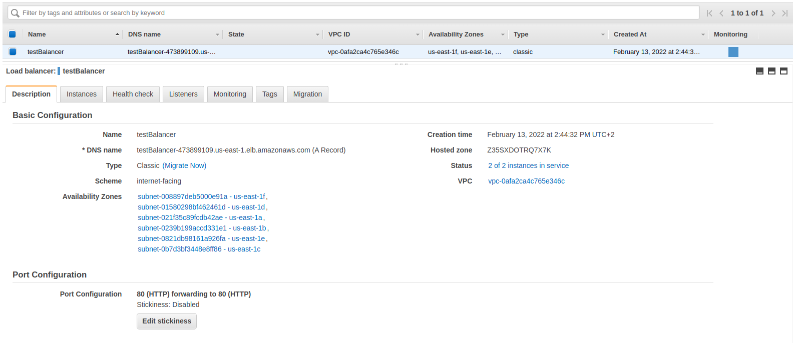

# EC2 and Load Balancing

AWS provide Load Balancing for EC2 instances with easy setup

### Setup simple apps on EC2 

Create two instances and run web applications on them 

Install docker, docker-compose and git:
```shell
sudo yum update -y

sudo amazon-linux-extras install docker
sudo service docker start
sudo systemctl enable docker
sudo usermod -a -G docker ec2-user

sudo curl -L https://github.com/docker/compose/releases/latest/download/docker-compose-$(uname -s)-$(uname -m) -o /usr/local/bin/docker-compose
sudo chmod +x /usr/local/bin/docker-compose

sudo yum install git -y
```

Clone this git repository, and run docker-compose :
```shell
docker-compose build
docker-compose up -d
```

Then need to configure security group for that instances (open 80 port)

### Setup and test Load Balancer

First, need to create a classic load balancer in EC2 console in section **Load Balancing** with 80 - 80 port configuration, setup health check and add previously created instances. Created load balancer should look like this:



To check working of load balancer we can change response (at `/ec2_load_balancing/app/main.py`) of one of our servers and restart compose:
```python
    return {"message": "Hello World 2"} 
```

and then verify by visiting our load balancer DNS several times:


```shell
curl http://testbalancer-473899109.us-east-1.elb.amazonaws.com/ -w "\n"
{"message":"Hello World"}

curl http://testbalancer-473899109.us-east-1.elb.amazonaws.com/ -w "\n"
{"message":"Hello World 2"}

curl http://testbalancer-473899109.us-east-1.elb.amazonaws.com/ -w "\n"
{"message":"Hello World"}

curl http://testbalancer-473899109.us-east-1.elb.amazonaws.com/ -w "\n"
{"message":"Hello World 2"}
```
