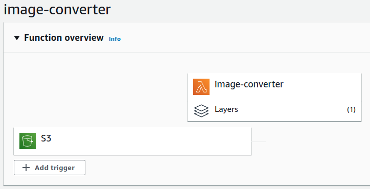
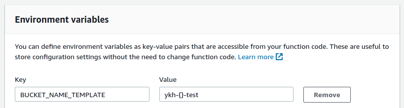
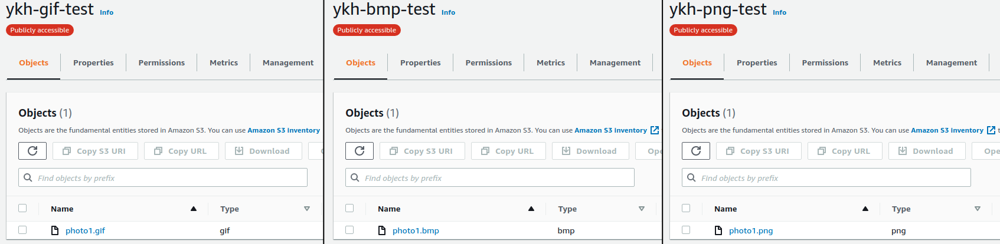

# Lambda

Example of usage of AWS Lambda for automatic image conversion



### Setup Buckets

Create four buckets for storing images. For naming, need to follow same template, difference should be only in file extensions, for example:
```
mybucket_jpeg_test
mybucket_png_test
mybucket_gif_test
mybucket_bmp_test
```

For testing purposes all of them should be with full public access:
```json
{
    "Version": "2012-10-17",
    "Statement": [
        {
            "Effect": "Allow",
            "Principal": "*",
            "Action": "s3:*",
            "Resource": [
                "arn:aws:s3:::{CURRENT BUCKET NAME}",
                "arn:aws:s3:::{CURRENT BUCKET NAME}/*"
            ]
        }
    ]
}
```

### Setup Lambda

Need to create from scratch new Lambda based on Python 3.8 runtime with code from `lambda_function.py` and with S3 trigger (`Event type: ObjectCreated`) and layer with libraries (pillow.zip). Also need to add an environment variable `BUCKET_NAME_TEMPLATE` with you bucket naming template as value:



### Testing

Just upload a new file into your jpeg bucket, converted files would be located in target buckets:


