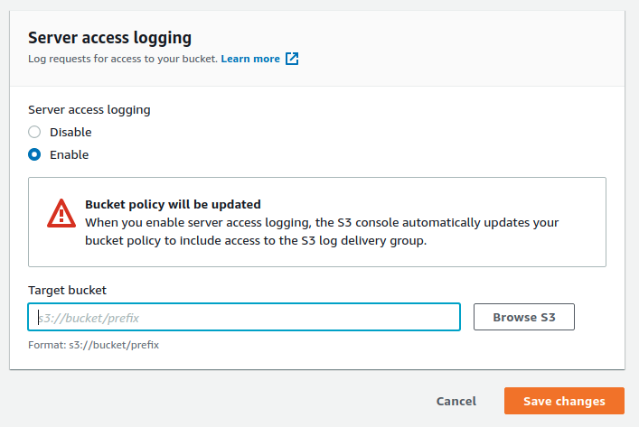

# WORM and access logging  on S3

Example of realization of write once read many (WORM) storage with access logging based on AWS S3.

### Setup S3 bucket

For realization of WORM need just during creation of bucket enable Object Lock:

and (if it is necessary) allow public access by unselecting checkbox **Block _all_ public access**:

For logging all requests to uploaded files need enable access log. Server access logging settings located at bucket **Properties -> Server access logging -> Edit**. Need just select radio button **Enable** and specify bucket for saving logs (that should be different bucket)   

After sone period of time logs will appear in target bucket:

